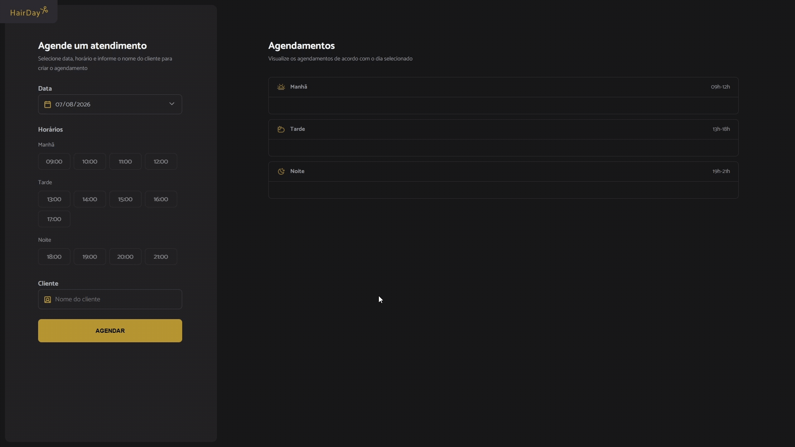

# HairDay

Sistema de agendamento para barbearias/salões, com criação, listagem e cancelamento de horários por período do dia (manhã, tarde, noite).




## Tecnologias

- JavaScript (ES Modules)
- Day.js (manipulação de datas)
- JSON Server (mock de API)
- Webpack
- Babel

## Funcionalidades

- Criar novo agendamento
- Listar agendamentos organizados por período do dia
- Cancelar agendamento existente
- Validação de horários já ocupados

## Como rodar o projeto

```bash
# Clone o repositório
git clone https://github.com/T1ag0o/hair_style.git

# Entre na pasta
cd hairday

# Instale as dependências
npm install

# Rode o servidor de mock (json-server)
npm run server

# Em outro terminal, rode o projeto
npm run dev
```

## Estrutura do projeto

```

src/
├── assets/              # ícones e imagens (SVG)
│   ├── afternoon.svg
│   ├── arrow-down.svg
│   ├── calendar.svg
│   ├── cancel.svg
│   ├── logo.svg
│   ├── morning.svg
│   ├── night.svg
│   ├── person.svg
│   └── scissors.svg
├── libs/
│   └── dayjs.js          # biblioteca de manipulação de datas
├── modules/
│   ├── form/              # lógica do formulário de agendamento
│   │   ├── date-change.js
│   │   ├── hour-load.js
│   │   ├── hours-click.js
│   │   └── submit.js
│   ├── schedule/           # renderização e ações da lista de agendamentos
│   │   ├── cancel.js
│   │   ├── load.js
│   │   └── show.js
│   └── page-load.js
├── services/               # comunicação com a API
│   ├── api-config.js
│   ├── schedule-fetch-by-day.js
│   ├── schedule-new.js
│   └── schedule-cancel.js
├── styles/
└── utils/
    └── opening-hours.js
main.js

```

## Aprendizados

Esse projeto foi construído pra praticar:
- Funções assíncronas (async/await)
- Manipulação do DOM sem framework
- Organização de código em módulos

## Licença

Este projeto está sob a licença MIT.
